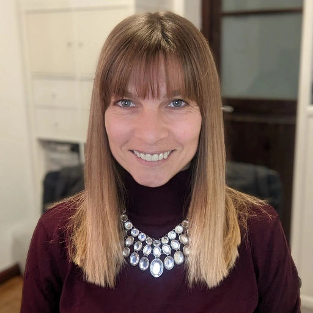

# About

{ align=right . width="270"}

## TL;DR

I am a Bulgarian designer who went to study in Sweden, met a Canarian, came to Tenerife for a while, and never left.

15+ years later I specialise in B2B and technical products, the kind built by engineers who never thought about brand. I make them look like someone cared.

I am a contractor. I work async, independently, and across time zones without anyone needing to check in on me.

---

## The longer version

I started with industrial design. I wanted to be an architect. I ended up somewhere more interesting.

My first job was at a research institute in Tenerife where I did a bit of everything: branding, web, print, photography, conference materials. Some of those projects are still live. That taught me that design is not a discipline, it is a habit of thinking.

A Master's degree introduced me to UX, responsive web design, and the idea that digital products are never finished, only improved. That clicked. I have been chasing that ever since.

I was the first designer hired at System73, a pure engineering company. They ignored me for a while. Eventually we figured out how to work together. Three years, 20+ features, one designer. The product got pivoted out of existence but the foundations survived.

After that, IMT. Then Acrolon Technologies, where I currently hold full design ownership of TankNET: brand, website, platform redesign, tradeshow assets, LinkedIn. The whole thing.

---

## Outside work

Making things is just how I think. Not a hobby, more of a default mode.

A few years back I designed and sewed my own wedding dress. Then I designed a full kitchen reform from scratch. Five years later it still looks exactly how I intended. Currently exploring 3D printed jewellery, which keeps getting pushed to the back of the queue but will happen.

I work out, I care about what I eat, and I am a mother. I use whatever tool makes sense: MacBook, Windows desktop, iPad, Android. Not out of brand loyalty, just function.

---

## How I work

Async by default. Direct in communication. Thick-skinned about feedback.

I work best when the brief is hard, the timeline is real, and nobody needs to schedule a meeting to tell me how I am doing.

---

*Bulgarian. Based in Tenerife. Working everywhere.*

[Get in touch](mailto:anelia.em.stoyanova@gmail.com)

## Career timeline