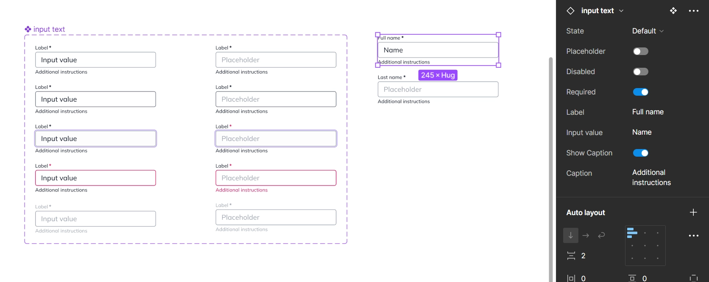

# Bridging the Gap: Design in Figma with HTML Input Types in Mind


In software development, when we want to collect information from users, we often use forms with labeled text fields. While these fields might seem a bit robotic to us humans, they're crucial for allowing communication between people and software. This communication helps systems create personalized experiences and recommendations within their digital interfaces.

<!-- more -->

## Design and Development

Designers and developers often face challenges in communication, leading to the creation of similar outputs. However, there's typically a lack of coordination between them. Designers design with humans in mind, naming their components' properties accordingly, which is great for keeping the focus on the user experience. On the other hand, developers operate in a more machine-centric environment. While this approach is beneficial in maintaining a human-centric design and a machine-centric development process, I believe that aligning certain aspects with similar names could greatly benefit both sides.

The journey from design concept to functional implementation is usually a bumpy ride. We, designers, craft visually appealing interfaces, developers have to translate these designs into tangible elements with specific characteristics defined in HTML. The challenge lies in ensuring that both parties speak the same language, minimizing misunderstandings and streamlining the development process.

## HTML Inputs

Here are 12 different input types that are most likely to be used in any website or digital product. 

1. Checkbox
2. Date
3. Date-time local
4. Email
5. Number
6. Password
7. Radio
8. Range
9. Search
10. Submit
11. Text
12. URL 

If you still need to check if there are even more types, you can go and explore the complete list on [MDN web docs](https://developer.mozilla.org/en-US/docs/Web/HTML/Element/input/button){ target="_blank"}. Almost all inputs have some common attributes that we are going to be addressing and we will see how we can set our Figma components for success. 

### Desired Anatomy

1. **Label** - a small introduction of the type of information that the user needs to fill in.
2. **Required field** - a small symbol invoking the required attribute, which will make the text field required on submit.
2. **The text field / input** - it is the actual field where users add the information.
3. **Supportive text / Caption** - only when necessary, and this little help does not exist as an html tag, we will be doing some hacks to include it.

## Input Text

Starting with the simplest of them all. Let's take a look and figure out what we need and how to define it.

#### HTML structure

``` html
<label for="name" class="inputLabel">Label</label> 

<input type="text" id="name" name="name" class="inputTypeText" required/>

<span class="inputCaption">Additional instructions</span>

``` 

And here is the result with no styling applied. We have only added some classes, so it is prepared for further retouches:

<hr>

<div class="defaultForm">

<label for="name">Label</label> <br />

<input type="text" id="name" name="name" required/> <br />

<span>Additional instructions</span>

</div>

<hr>

What we need to have in mind when designing: 

1. The input type, which will be the name of the Figma component: `#!html <input type="text">`
2. Attributes to consider inlcuding in a boolean property: `disabled, pattern, placeholder, readonly, required, size`

#### CSS pseudo classes

`:hover`, `:focus`, and `:active` 

The order of these pseudo classes is very important and we should always define them as follows[^1]: 

1. Hover
2. Focus
3. Active

[^1]: Bits of code - 
Articles on frontend engineering and more [When do the :hover, :focus, and :active pseudo-classes apply?](https://bitsofco.de/when-do-the-hover-focus-and-active-pseudo-classes-apply/){ target="blank" }

The question is how can we link these properties to the Figma panel? Let's figure it out...

#### Figma component properties

1. Component name: **Input text**
2. Show Placeholder: True / False
3. States <span class="handnotes">CSS pseudo classes</span>: 
    - Valid
    - Hover 
    - Focus 
    - Invalid 
4. Disabled: True / False <span class="handnotes">HTML attribute</span>
5. Required: True / False <span class="handnotes">HTML attribute</span>
6. Label edit property
7. Input value edit property
8. Placeholder edit property
9. Show Caption
10. Caption edit property

