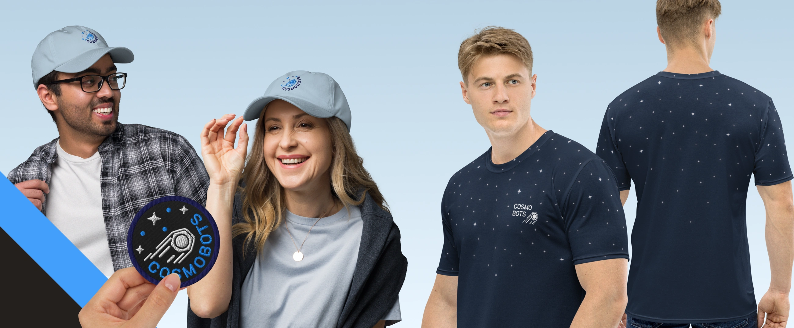
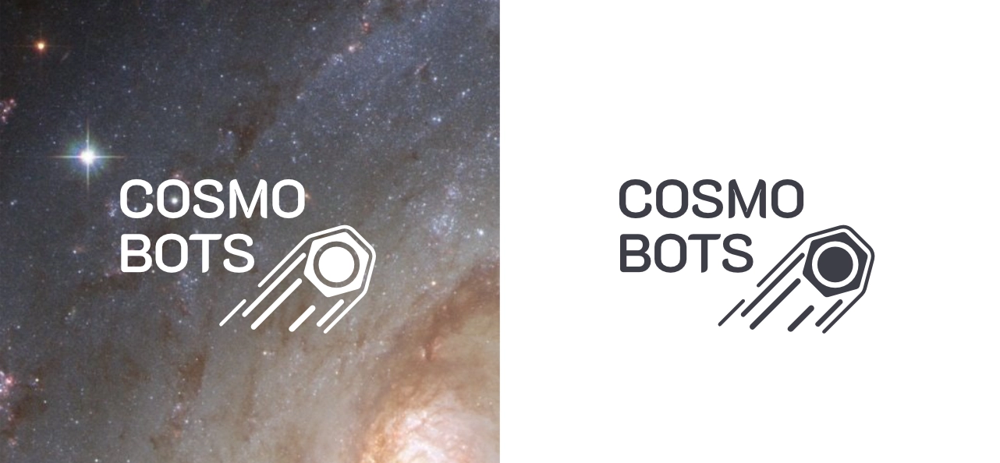
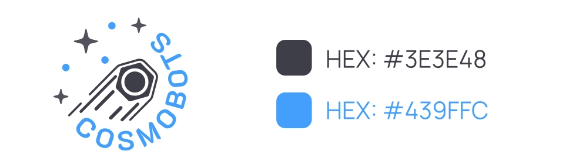

**Visual Identity for a Volunteer-Driven Tech Collective**

{ .postCover }

## Project Summary

-   :material-badge-account:{ .middle .iconSummary }  __Client__

    ---

    **Cosmobots**  
    Volunteer-Driven Tech Collective

-   :material-calendar-expand-horizontal:{ .middle .iconSummary }  __Timeline__

    ---

    Sep 2018  

-   :material-face-woman-shimmer:{ .middle .iconSummary }  __Role__

    ---

    Branding Designer

-   :material-bullseye-arrow:{ .middle .iconSummary }  __Technology__

    ---

    Affinity Designer

## The Challenge

COSMOBOTS is a non-governmental, non-profit organization made up of local tech enthusiasts who build projects in their spare time, just for the joy of experimenting, collaborating, and making cool stuff.

They needed a visual identity that captured their DIY spirit and love of all things sci-fi and tech—without making them look like a corporate startup or an actual space agency (because… they’re not, no matter how many LEDs they wire up). The brand had to reflect fun, inclusivity, and a little bit of that "we just built this at 2AM in someone’s garage" energy.

## The Concept 

The identity for COSMOBOTS centered on three core themes:

1. **Tech as Play** – because this isn’t about profit, it’s about passion.
2. **Community** – it's a group of like-minded humans (not bots) with a shared love for invention.
3. **Space Weirdness** – because space themes are just cooler, obviously.

The brand needed to look like it was created by people who solder for fun and could casually build a Mars rover out of scrap parts if they had a weekend and a lot of coffee.

## Design Process

### Voice & Vibe
The tone of the COSMOBOTS identity reflects the group’s purpose: dedicated, collaborative, and quietly ambitious. This isn’t about commercial flash, it’s about the passion for building tech projects that benefit local institutions and communities. The voice is practical and respectful, with a subtle nod to innovation through its symbolism.

### Logo & Typography
The visual identity was built around a single, strong symbol: a **comet** fused with a **bolt**. This combination captures both motion (progress, momentum) and engineering (building, fixing, creating). The mark is simple and versatile, easy to apply across different contexts—from app splash screens to documentation headers.

### Color System

The COSMOBOTS logo deliberately avoids a full color palette. It stays clean and utilitarian with a light blue and dark gray combination:

- Light Blue for clarity, openness, and calm innovation
- Dark Gray for structure, balance, and technical focus

This minimalist use of color reinforces the collective’s values, function and community.

### Adoption
Once finalized, the branding was embraced by all members of the collective. The mark began appearing across code repositories, local project UIs, documentation, and team communications. Its simplicity made it easy to implement, and its symbolism created a shared visual language for contributors, regardless of project type or technical background.

## Reflections 

COSMOBOTS reminded me why I love branding, not to sell something, but to celebrate it. It was a chance to design for people who are driven not by profit, but by curiosity. And it turns out, a group of semi-chaotic tech volunteers can have stronger brand vibes than most actual tech companies. Who would've thought?!

