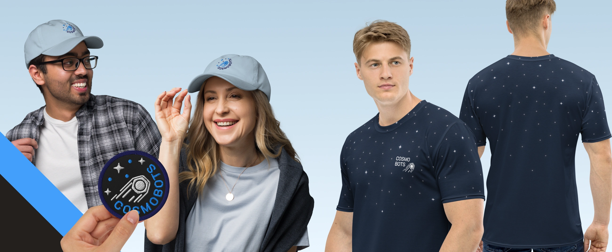
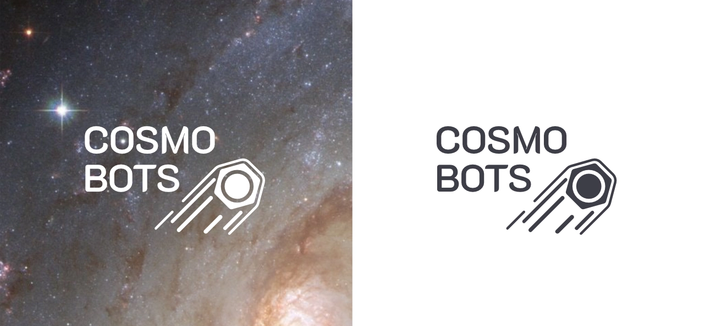
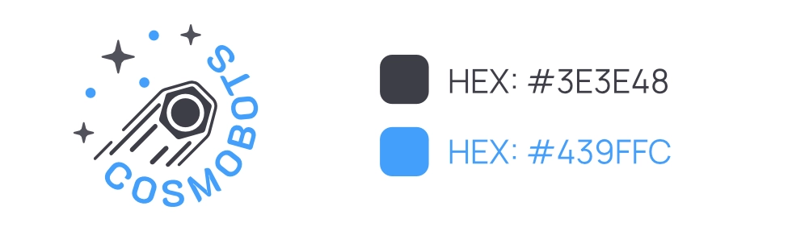

# Cosmobots

**Visual identity · Volunteer tech collective · Tenerife**

{ .postCover }

## The brief

Cosmobots is a group of local tech enthusiasts who build things in their spare time. My husband is one of them. They wire up LEDs, run experiments, collaborate on projects that benefit local institutions and communities — not for profit, just because building things is what they do.

They set up a Redmine instance to manage their projects and needed a logo to go with it. They asked me. I said yes.

**Timeline:** September 2018
**Tools:** Affinity Designer

## The concept

A comet fused with a bolt. Motion and engineering in one mark. Simple enough to work on a Redmine header, versatile enough for everything else.

The color system stayed deliberately minimal — light blue and dark gray. Calm, functional, not trying to look like a startup.

## What happened to it

The collective slowed down as life took over. People got busy with their own work. But they still meet from time to time, the Redmine is still running, and real companies use it every day — which means the logo gets seen by people who have no idea where it came from.

We had patches embroidered. Dad hats too.

Years later, this project is till tracking in ways I did not expect at the time. Small work has long chains.

---

*Affinity Designer · Brand identity · 2018*
