# Hornets Hockey

**Brand identity · Youth Roller Hockey Club · Tenerife**

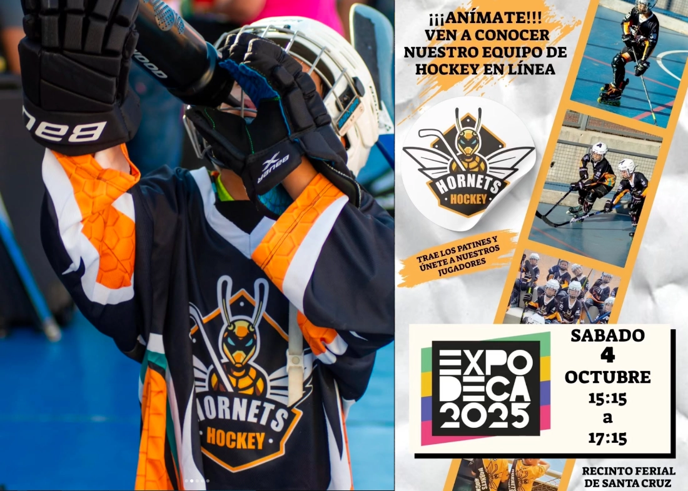{ .postCover }

## The brief

A local youth roller hockey club needed a visual identity. Something that felt serious enough for a sports team but fun enough for kids. Had to work on uniforms, flyers, social media, and - crucially - embroidered patches.

My friend runs the club. He had a folder of reference logos. We started there.

**Timeline:** July 2023
**Tools:** Midjourney, Affinity Designer on iPad

## The process

Started with brainstorming in Midjourney, exploring the character, the spirit, the hockey energy.

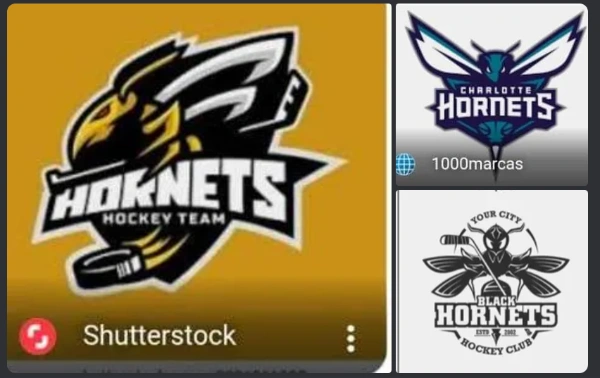{ align=left .width50}

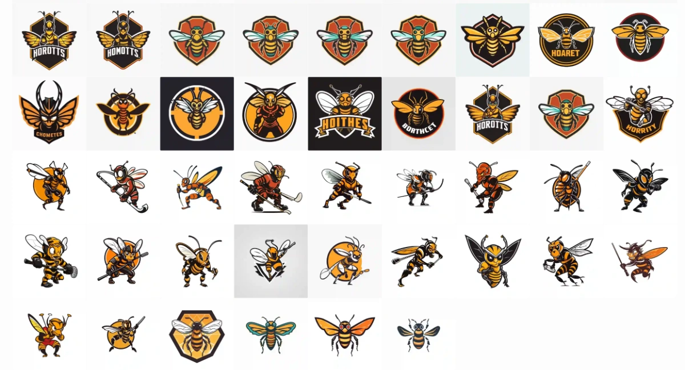

Once the direction felt right, I pushed deeper into detail - shape, posture, expression.

    

        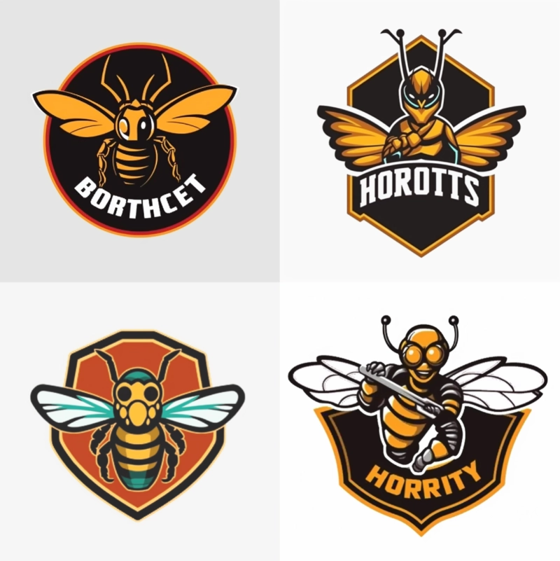
    

    

        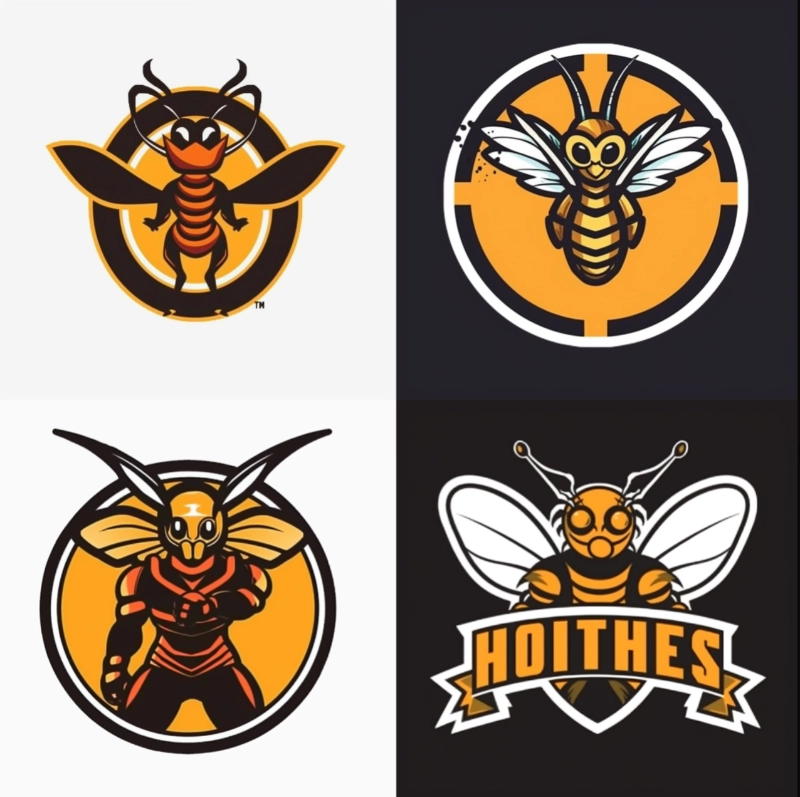
    

    

        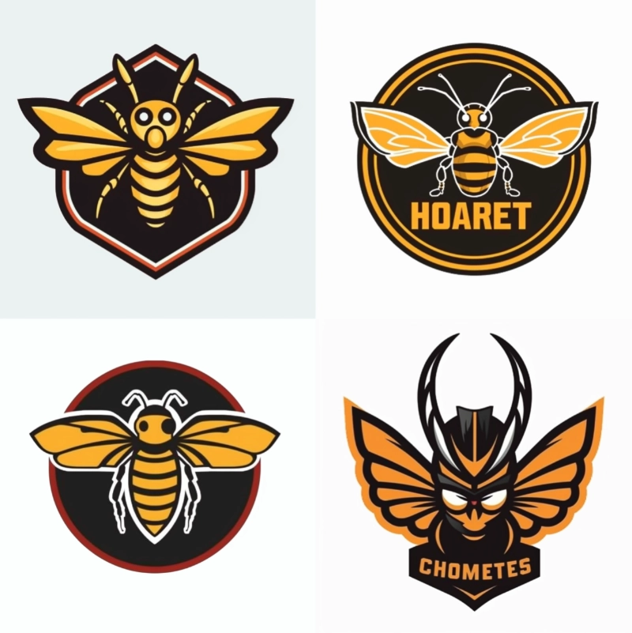
    

## Assembling the character

No single generation was perfect. Some had the right body shape. Others had the right face. The wings were wrong in every version, so I drew those separately.

    

        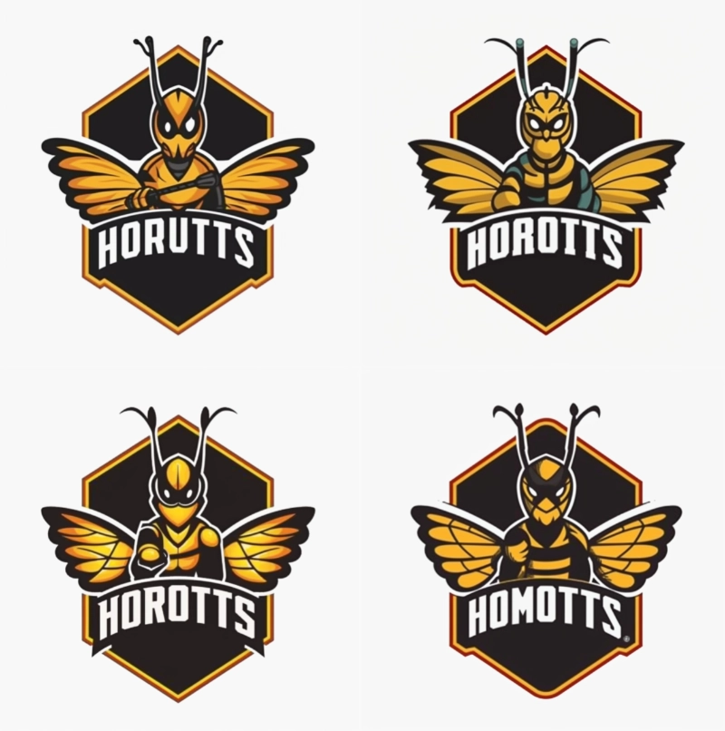
    

    

        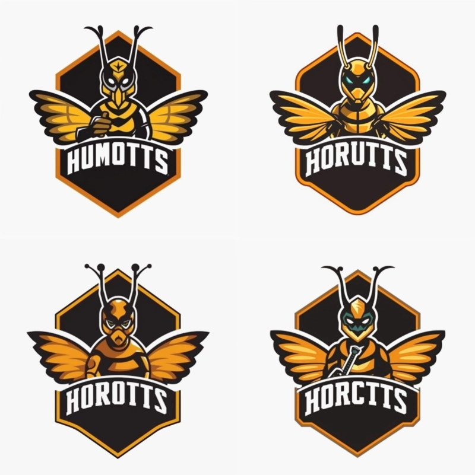
    

    

        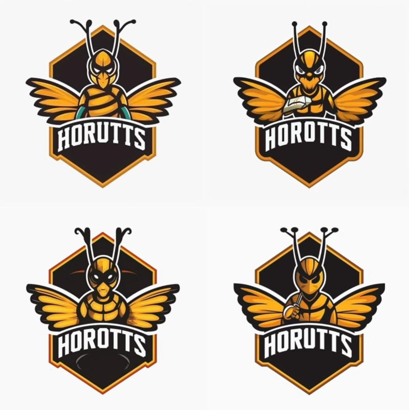
    

    

        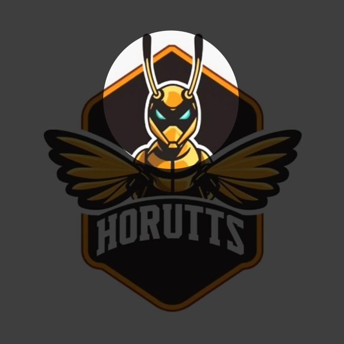
    

    

        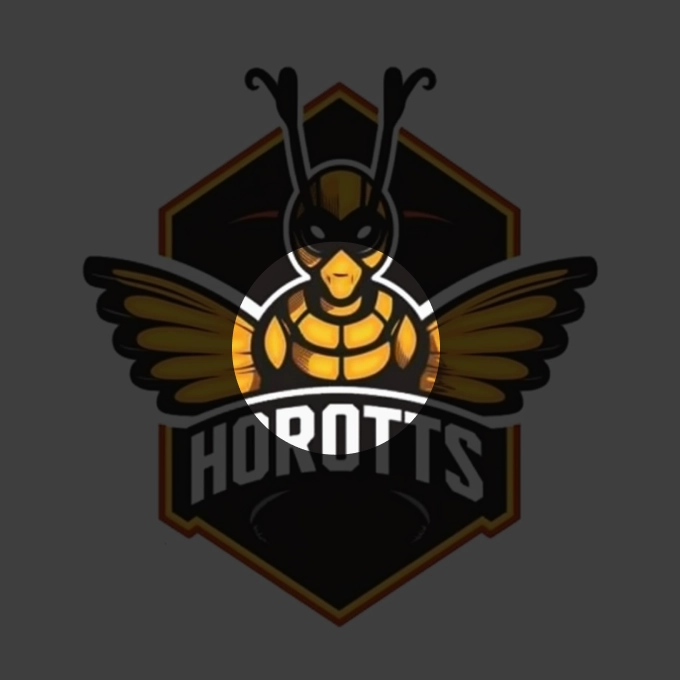
    

    

        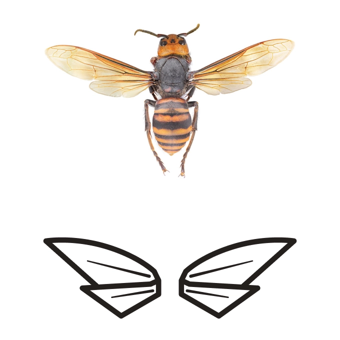
    

I collaged the best parts together in Affinity Designer on iPad, sent it for approval, got the OK, then vectorized the final shape - clean, scalable, embroidery-ready.

## The final logo

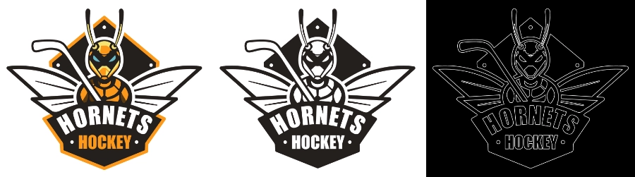

## Color palette

## In use

The club is active and the logo is out there. Uniforms, patches, social media. You can follow them at [@hornetshockeytenerife](https://www.instagram.com/hornetshockeytenerife/).

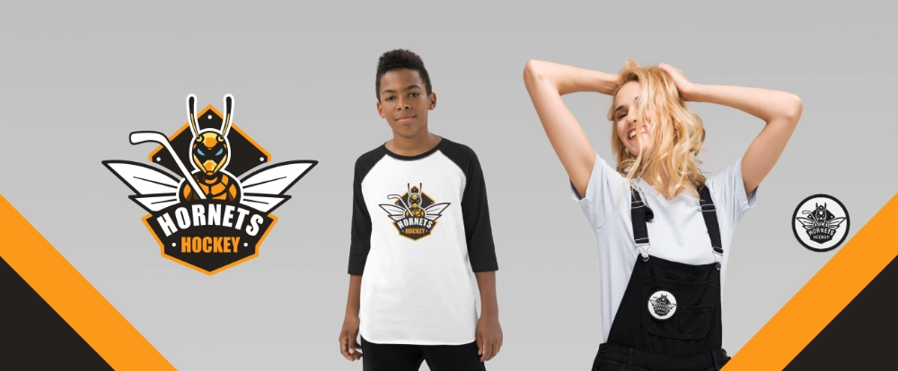

The whole thing took one day.

---

*Midjourney v.4 + Affinity Designer on iPad · Brand identity · 2023*
