# PECA'S Tenerife

**Brand presence & content strategy · Local fashion retail · Tenerife, Spain**

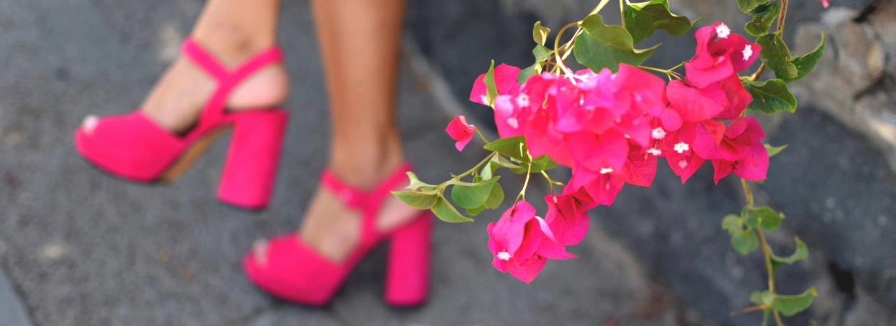{ .filterGray .postCover }

## The brief

A well-known local shoe chain in Tenerife decided to enter the online market. The infrastructure was already in place: warehouse management, database connections, seasonal collection schedules. What didn't exist was anything to actually post.

The brands supplied their own manufacturer photography. Using it would have made PECA'S invisible, just another reseller showing the same images as every other shop. We needed original material.

**Timeline:** Jul 2017 – Dec 2018

**Role:** Content designer, product photographer, social media

## Humble beginning

We had no model at the start. So I improvised.

I started building compositions: grouping shoes by type, colour, and size, arranging them until they looked like something worth stopping for. No feet, no person, just the product and the light. 

It worked better than expected. The following started growing.

Once we got a model, the quality of the shoots improved significantly. But the composition-first instinct stayed.

### Studio Photoshoots

    

        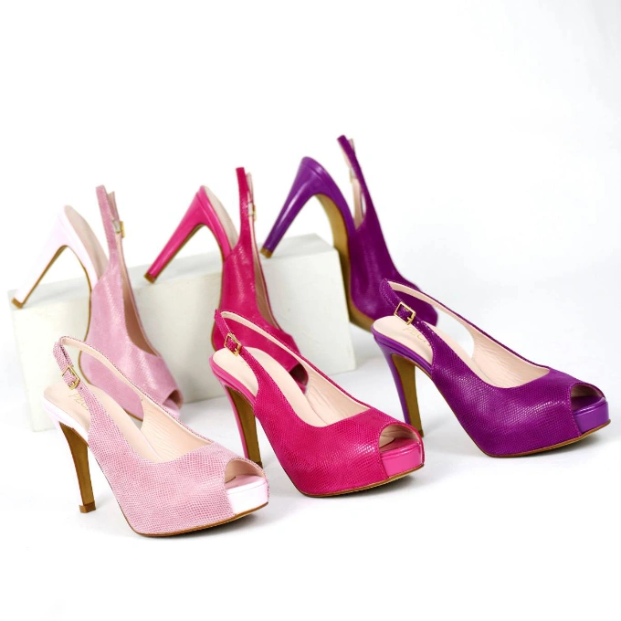
    

    

        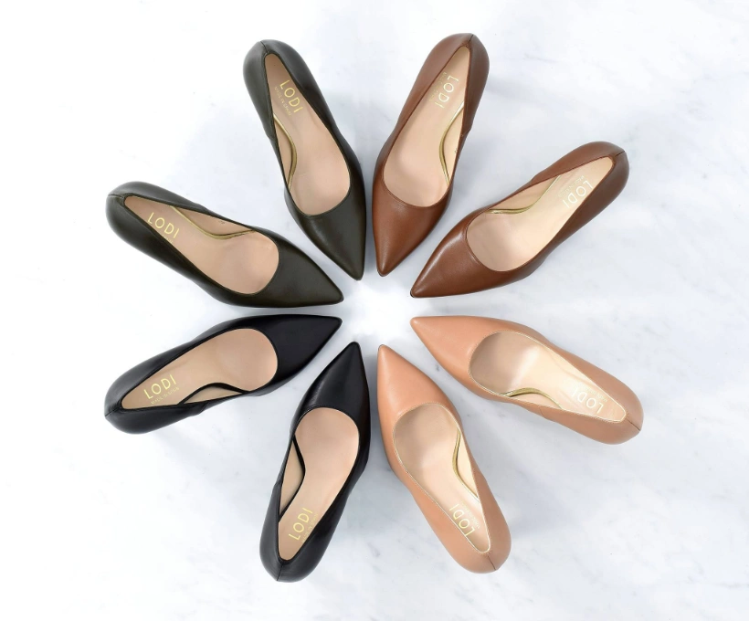
    

    

        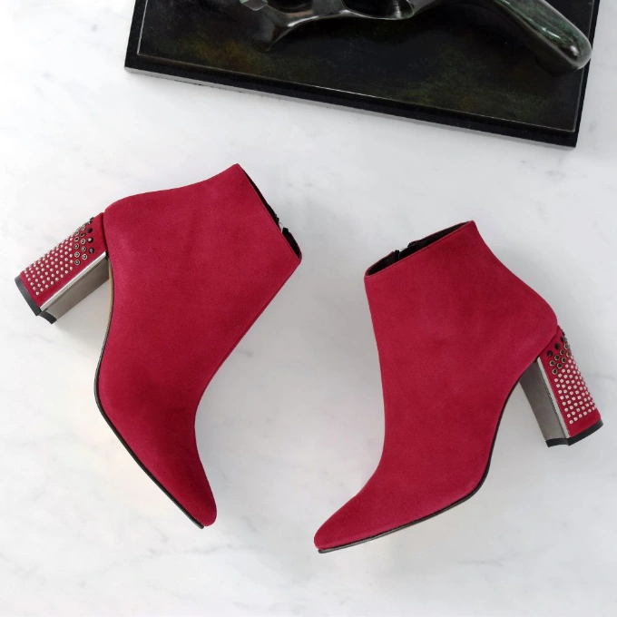
    

    

        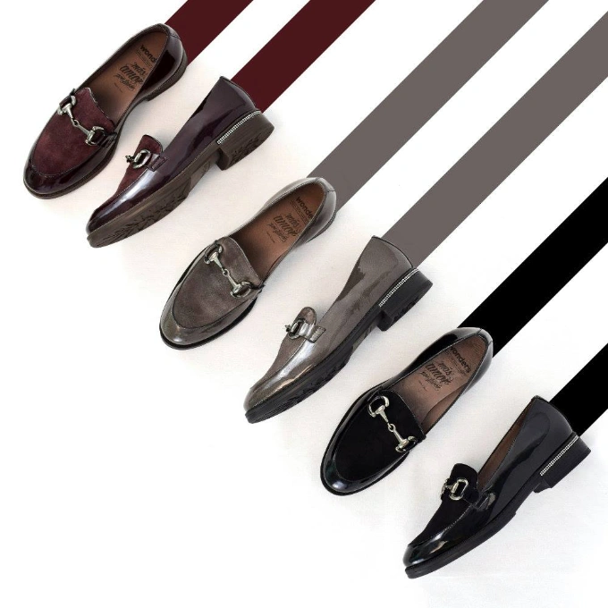
    

    

        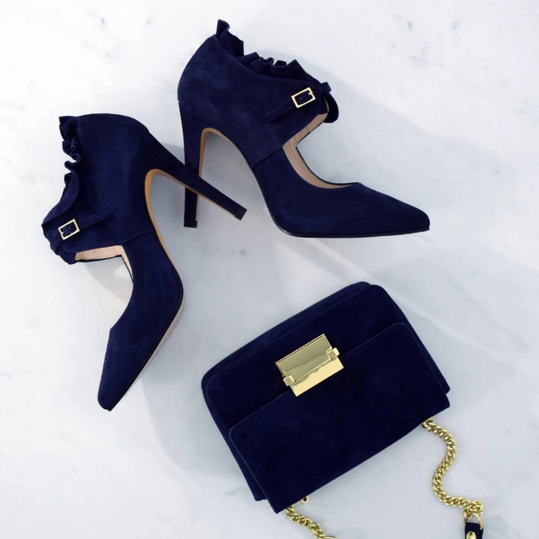
    

    

        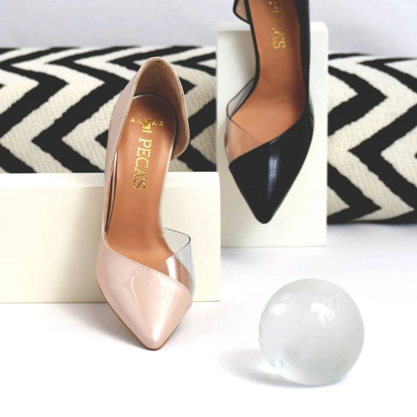
    

## Outside the studio

As the project grew we took shoots outside: streets, natural light, real context. The shoes needed to live somewhere, not just sit on a surface.

### Outside Photoshoots

    

        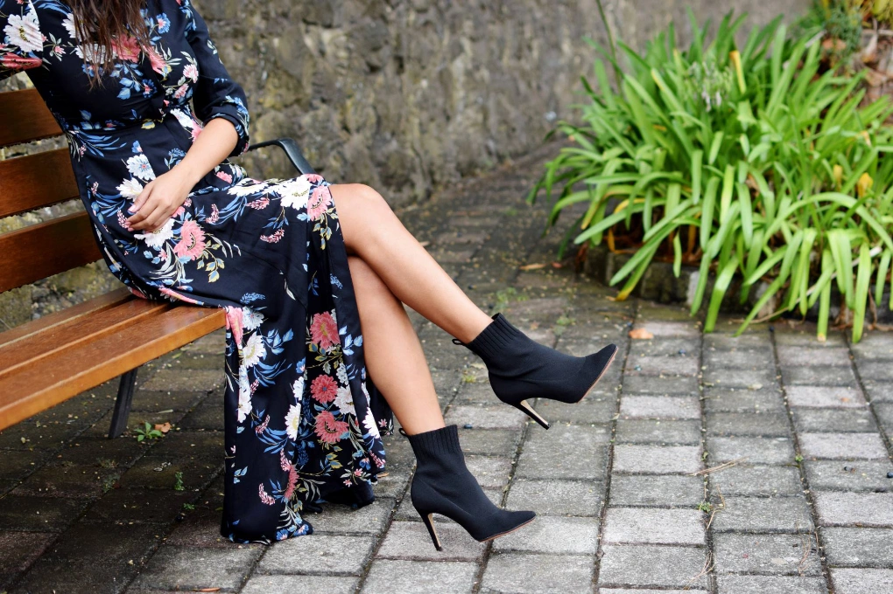
    

    

        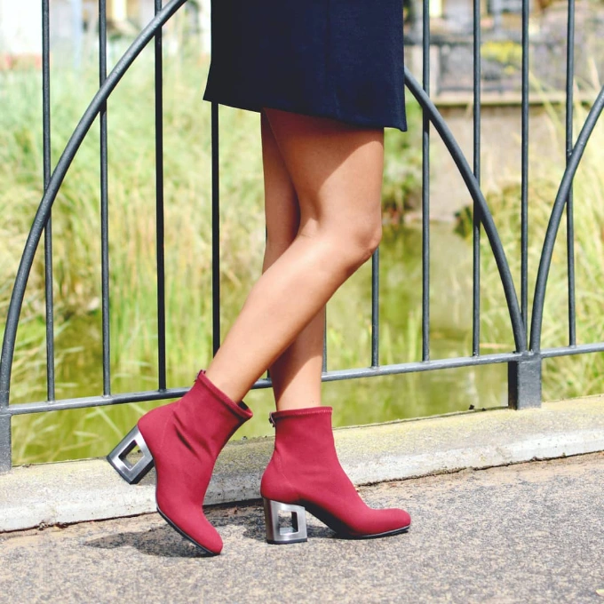
    

    

        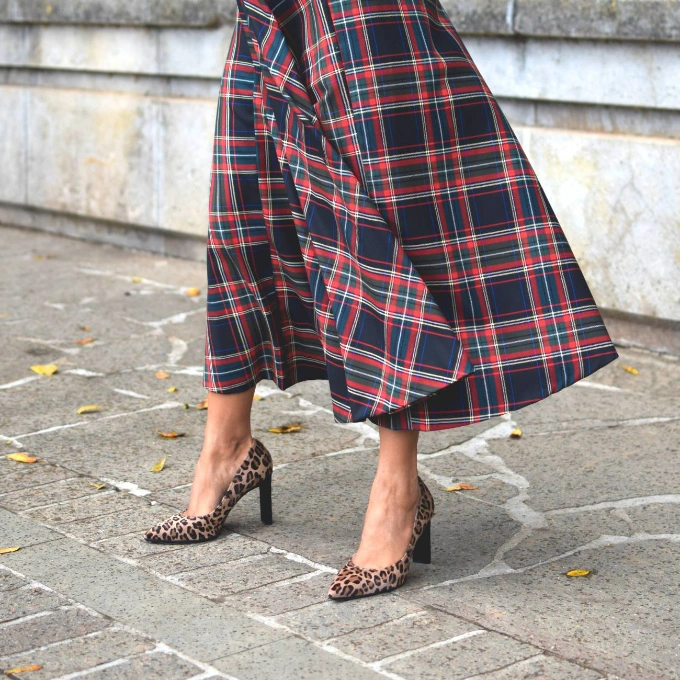
    

    

        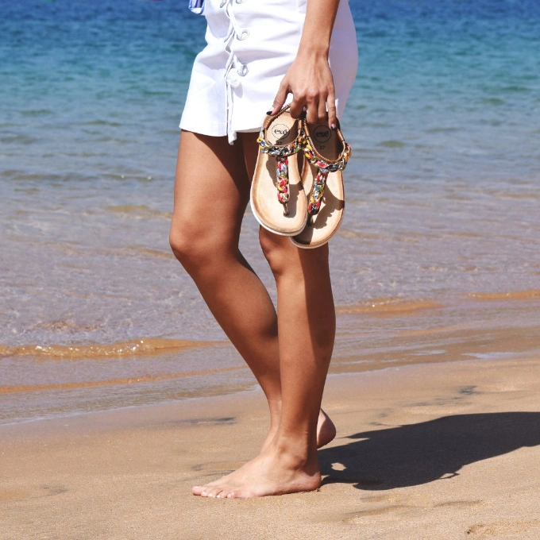
    

    

        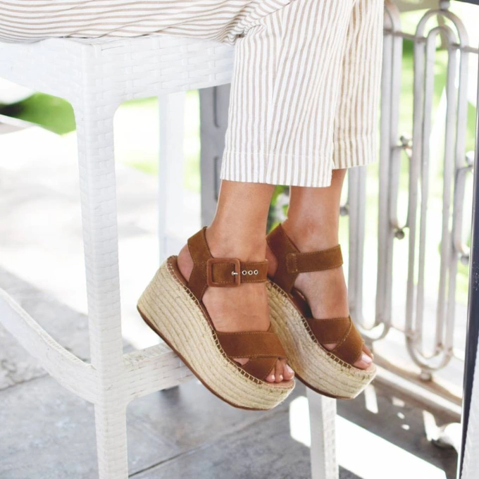
    

    

        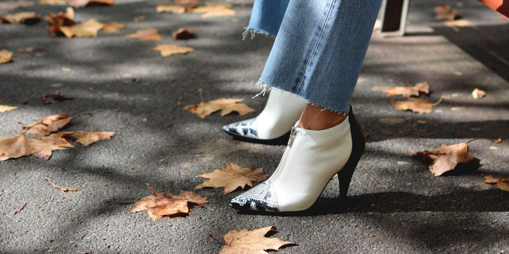
    

    

        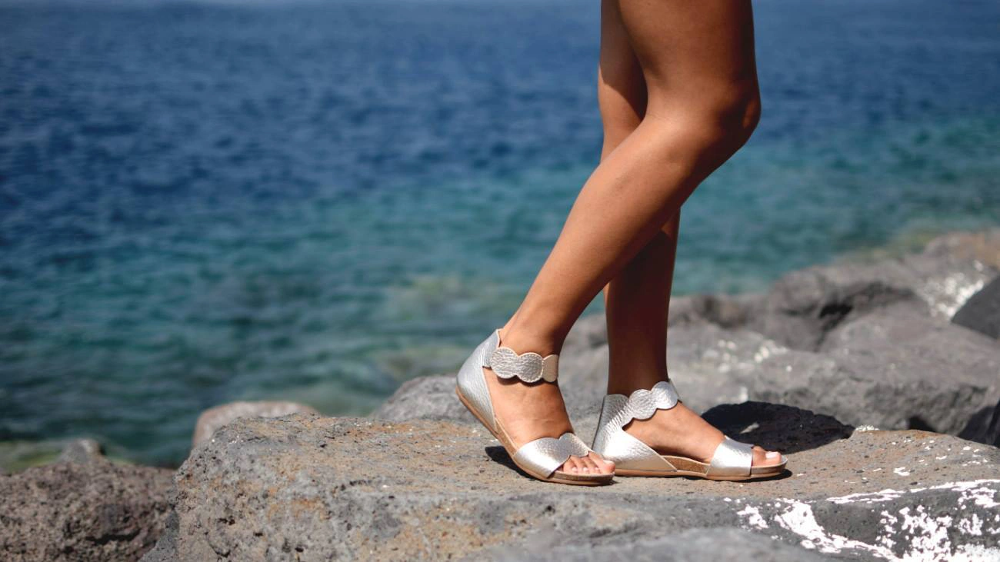
    

    

        
    

## When the manufacturers start reposting your work

The compositions caught attention beyond the local market. Several shoe manufacturers (Dansi, Lodi, Wonders) reposted our images on their own social media profiles. For a small local retailer, that's not a small thing.

    

        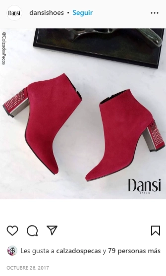
    

    

        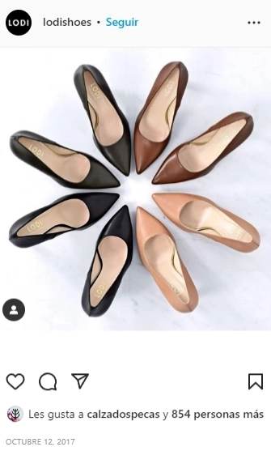
    

    

        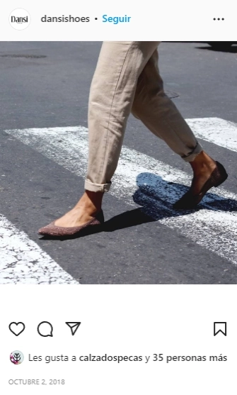
    

## In-store

Not everything happened in a studio. Seasonal campaigns, store openings, Christmas: the brand needed to show up in the physical space too.

### In-Store Photoshoots

    

        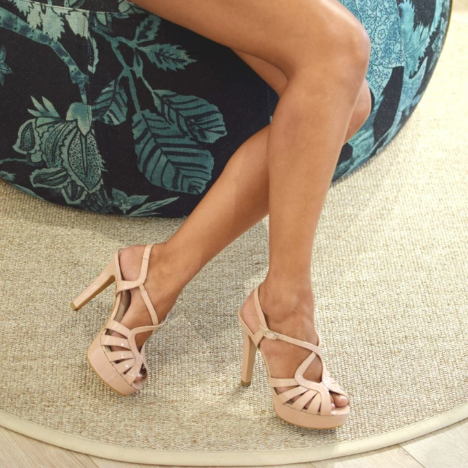
    

    

        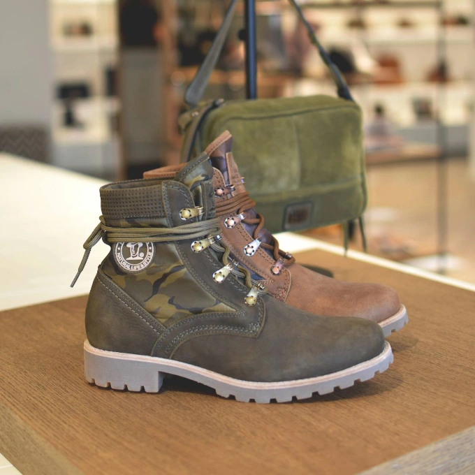
    

    

        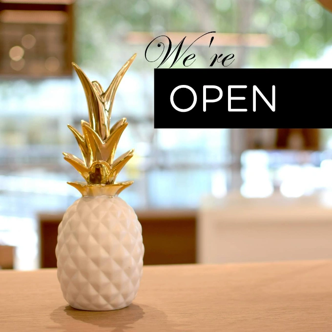
    

    

        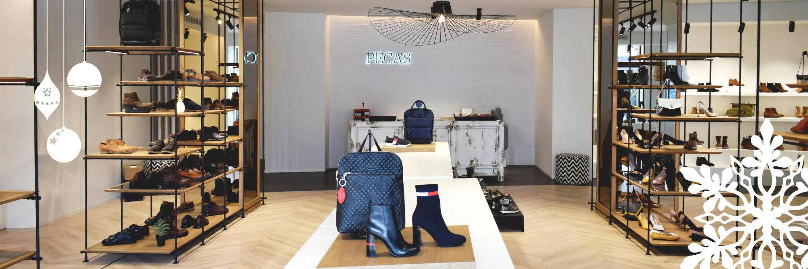
    

## The numbers

Facebook: 0 → 7,000 followers
Instagram: 0 → 2,300 followers

Built from nothing, over 18 months, with original content created in-house from scratch.

---

*Photography, content strategy, and social media management · Calzados PECA'S Tenerife*

All images are property of [Calzados PECA'S](https://pecas.com){ target="_blank" } Tenerife.
