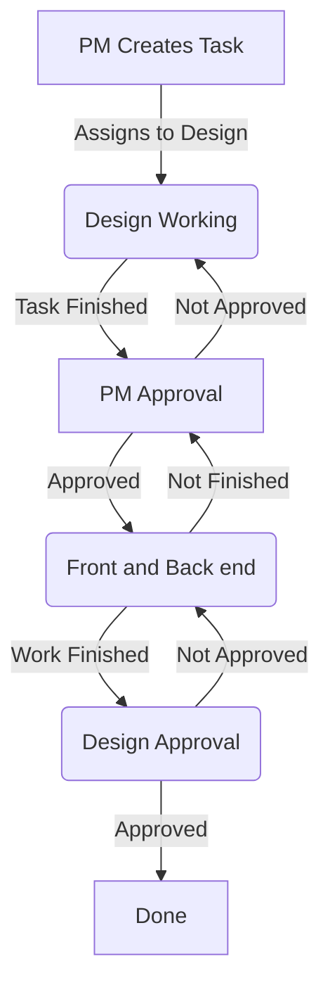

# KUNO

<figure markdown>
  
  <figcaption>Online Video Platform</figcaption>
</figure>

## Project Summary

-   :material-badge-account:{ .middle .iconSummary }  __Client__

    ---

    **System73**  
    Powering Porfitable Streaming

-   :material-calendar-expand-horizontal:{ .middle .iconSummary }  __Timeline__

    ---

    Mar-2019 <--> Jun 2022  
    (3 yrs 4 mos)

-   :material-face-woman-shimmer:{ .middle .iconSummary }  __Role__

    ---

    - Product Designer

-   :material-bullseye-arrow:{ .middle .iconSummary }  __Achievements__

    ---

    - 20+ new features
    - Clickable prototype - Adobe Xd
    - Process definitions for development
    - Fun retrospectives planning

## User Story

> **We want** to improve our recently created Online Video Platform, **so that** our content creators from our two online tv channels **can upload and manage** three different types of video content. 

We also need to define a clear workflow for the different stages: "*design - development  - stakeholders*", to improve collaboration and predictability of deliverables.

## Goals

1. Improve existing interface (the platform is based on Vuetify 2)
2. Introduce Feature Defintion Development Flow
3. Define and Test Clear User Tasks
4. Maintain a complete Clickable Prototype
5. Create User's Help Center
6. Help with internal documentation

## Feature Definition Flow

In a only one designer team, surrounded by developers, the role of design is not very clear. The person that is responsible for the task is going to have tough time dealing with people not knowing the purpose of design. 

The final goal of feature definition flow is to get to a level where you can anticipate around 80%-95% what is expected to happen and how it will happen, leaving the smallest percentage to simple coincidence. 

Wireframe -------> Prototype -------> Reality

How do we accomplish that? 

In this project we followed these steps. But again, they need to adapt to the actual team work at the company, how the teams communicate and create things, and finally, how they make sure everybody is working on their part of the same project, following the same goal. 

### PRD - Product Requirements Document

When in multidisciplinary meetings people talk without drawing out things on the whiteboard (or any virtual equivalent) everybody leaves with a different idea in their head. It's not a problem when you know that it happens. 

How might we anticipate this? 

We can create a one page Product Requirements Document that is putting black on white what we are commiting to deliver. The whole feature scope, the phases that we estimate it would need to be completed, adapting them to the development team cycles of planning. 

Once the definition meeting has ended and everybody in it had approved the pre-requirements and commitments, there is no place for "You said" "I said" discuccions - it's all written and available for everyone. 

Very good guide you can follow adapting to your needs --> [:material-open-in-new:{.middle} Atlassian PRD](https://www.atlassian.com/agile/product-management/requirements){ target="_blank"}

### Wireframing

Before any design start, we (designers) need to know what is needed. Before coming up with 20 different versions of the same thing, we save a lot of time, gathering ideas from others, most of all because there are countless technical limitations and compromises that can result in wasted time. 

This step is crucial, and I've found that including different people from different parts makes it better. Why? Because not the same people attend all of the meetings, and everybody feels included in the decision making process, which at the end makes the project feel personal to each one of the team members. It's a win-win situation. 

### Prototype

Prototypes are super important in the process of designing because they help get the "feal" of a product, something static screens are never going to be able to accomplish. 
Back before Sketch even existed, people were designing websites in Photoshop, it is a very cool tool, but it has several problems:

- it's not cheap
- it has a very steep learning curve
- it is everything but interactive

When Sketch appeared and left behind everybody that didn't have MacOS hanging, other alternatives started emerging. AdobeXd was one of them. From the very beginning it was including at least MacOS and Windows designers (a lot more than just MacOS). It started with interactive prototype mode, in the beginning just a simple click through and then it got more complicated, but being able to click on a button and resolve a new screen gets clients and stakeholders something nothing else can provide - "the feel" of the product. 

Prototype is essential for solving problems, showing off your next cool feature, and explaining a design to a developer. A picture indeed is worth a 1000 words, and when it is interactive, even more. 

In this step, we are able to come up with ideas, try them out, validate if they work or not, and we can also make errors that would be very much complicated to solve, once the feature has been developed. 

This is one screen prototype embed made in Figma. :material-arrow-down:

<iframe style="border: 1px solid rgba(0, 0, 0, 0.1);" width="800" height="450" src="https://www.figma.com/embed?embed_host=share&url=https%3A%2F%2Fwww.figma.com%2Fproto%2FalDXlktB2GDEDV66ajWORQ%2FSystem73%3Fpage-id%3D1%253A328%26type%3Ddesign%26node-id%3D50-10206%26viewport%3D-2770%252C3691%252C0.56%26t%3DjgzEouMvOmsbgy97-1%26scaling%3Dscale-down%26starting-point-node-id%3D50%253A10206%26mode%3Ddesign" allowfullscreen></iframe>

### Test

No matter how great you think your project is coming up, it has flaws, the sooner you pick on them, the better, it will have less for developers to drive even further. 
I don't care how great at design you think you are, people do not use products as they are intended, almost ever.

If you don't beleive me, look at this viral video: 

??? note "♬ The Square Hole"

    <blockquote class="tiktok-embed" cite="https://www.tiktok.com/@tired_actor/video/6912855387788102918" data-video-id="6912855387788102918" style="max-width: 605px;min-width: 325px;" > <section> <a target="_blank" title="@tired_actor" href="https://www.tiktok.com/@tired_actor?refer=embed">@tired_actor</a> <a title="duet" target="_blank" href="https://www.tiktok.com/tag/duet?refer=embed">#duet</a> with @brock1137 no please no <a title="funny" target="_blank" href="https://www.tiktok.com/tag/funny?refer=embed">#funny</a> <a title="welcome2021" target="_blank" href="https://www.tiktok.com/tag/welcome2021?refer=embed">#Welcome2021</a> <a title="2021" target="_blank" href="https://www.tiktok.com/tag/2021?refer=embed">#2021</a> <a title="newyear" target="_blank" href="https://www.tiktok.com/tag/newyear?refer=embed">#newyear</a> <a title="firstpost" target="_blank" href="https://www.tiktok.com/tag/firstpost?refer=embed">#firstpost</a> <a title="viral" target="_blank" href="https://www.tiktok.com/tag/viral?refer=embed">#viral</a> <a title="fyp" target="_blank" href="https://www.tiktok.com/tag/fyp?refer=embed">#fyp</a> <a title="foryou" target="_blank" href="https://www.tiktok.com/tag/foryou?refer=embed">#foryou</a> <a title="foryoupage" target="_blank" href="https://www.tiktok.com/tag/foryoupage?refer=embed">#foryoupage</a> <a title="comedy" target="_blank" href="https://www.tiktok.com/tag/comedy?refer=embed">#comedy</a> <a title="crying" target="_blank" href="https://www.tiktok.com/tag/crying?refer=embed">#crying</a> <a title="2020" target="_blank" href="https://www.tiktok.com/tag/2020?refer=embed">#2020</a> <a title="rareaesthetic" target="_blank" href="https://www.tiktok.com/tag/rareaesthetic?refer=embed">#RareAesthetic</a> <a target="_blank" title="♬ The Square Hole - brock1137" href="https://www.tiktok.com/music/The-Square-Hole-6912243937592068869?refer=embed">♬ The Square Hole - brock1137</a> </section> </blockquote> 

I had almost the same experience with the Online Video Platform, after making some tests, a huge list of flaws started piling up, and we had to fix them in the next *sprints*. 

Here is one of the Affinity boards that we had generated: 

### Developers Handover

We figured out that if we have a design file that is always changing, because design works on it while the development team is adding new functionalities it was resulting in always changing requirements and confusion. 

What we did?

We started closing versions for design. What I mean by that is that, every feature that was approved to go to development had been closed as a fixed number, no changes were allowed until developed. 

It is not very easy to manage that, given the design software, but we managed to control a big part of it, and nobody had to deal with frustration because things were changing without any notice.

The specifications were included in the Jira tickets for development, and there was a constant thread of communication between FrontEnd and Design, while developing new features. 
 
### Validation

We made this interlocked circle of approval, so we could take out emotion and personal opinions of the development process. 

This simple process removed personal relationships from the work, saved a lot of time of the PM's agenda and made sure that everybody was finishing their part of the process. 

### Documentation

#### Help Center

We had already introduced more than 20 features, and we started detecting that our users did not know what could be done, how do they accomplish simple things with the available features, so we developed the Help Center. 

It was meant to be a general guide where you could find all the features that are available on the platform. 

The site is still available, but the Online Video Platform is not, so a good chunk has been cut off of it. 

#### Internal documentation

The complexity of some of the features required to create some internal documentation, so new people could learn everyhing about the platform, and gather as much information as possible when they joined the team. 

### Final Deploy

Once completed all those steps explained above, we were at the stage for Final Deploy, which means make the new thing available to our users. 

In normal circumstances it should be the end of the road, but not in software. It is only the beginning of the real troubles, services fail, users complain, sometimes the infrastructure doesn't support things... a lot can go wrong at this stage. If the team is good, this stage will be managed as well as the other ones. 

### Maintainence 

Now this is the actual end of the road. When we are finally sure that the feature does what it is supposed to, users are no longer confused by it, and it needs minimal efforts to have it running. 

## Branding material