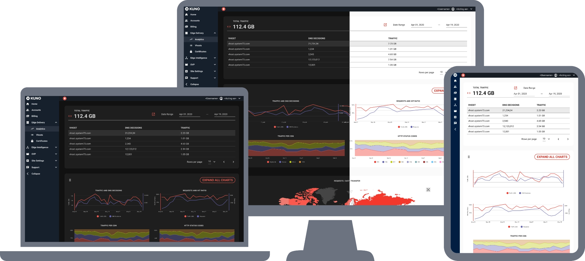

# KUNO

<figure markdown>
  
  <figcaption>Online Video Platform</figcaption>
</figure>

## Project Summary

-   :material-badge-account:{ .middle .iconSummary }  __Client__

    ---

    **System73**  
    Powering Porfitable Streaming

-   :material-calendar-expand-horizontal:{ .middle .iconSummary }  __Timeline__

    ---

    Mar-2019 <--> Jun 2022  
    (3 yrs 4 mos)

-   :material-face-woman-shimmer:{ .middle .iconSummary }  __Role__

    ---

    - Product Designer

-   :material-bullseye-arrow:{ .middle .iconSummary }  __Achievements__

    ---

    - 20+ new features introduction
    - Clickable prototype - Adobe Xd
    - Process definitions for development
    - Fun retrospectives planning

## User Story

**We want** to improve our recently created Online Video Platform, **so that** our content creators from our two online tv channels **can upload and manage** three different types of video content. 

We need to define a clear workflow for the different stages: "*design - development  - stakeholders*", to improve collaboration and predictability of deliverables.

## Goals

1. Improve existing interface (the platform is based on Vuetify 2)
2. Introduce Feature Defintion Development Flow
3. Define and Test Clear User Tasks
4. Maintain a complete Clickable Prototype
5. Create User's Help Center
6. Help with internal documentation

## Feature Definition Flow

In a only one designer team, surrounded by developers, the role of design is not very clear. The person that is responsible for the task is going to have tough time dealing with people not knowing the purpose of design. 

### PRD - Product Requirements Document

### Wireframing

### Prototype

### Test

### Developers Handover

### Validation

### Documentation

### Final Deploy

### Maintainence 

