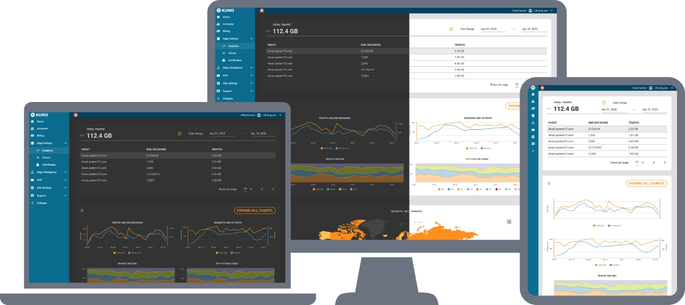
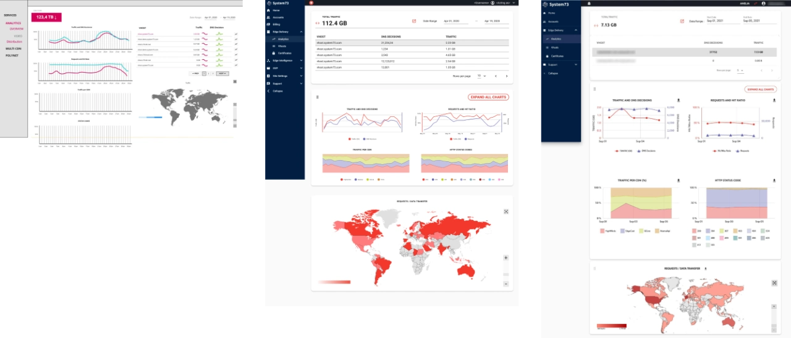
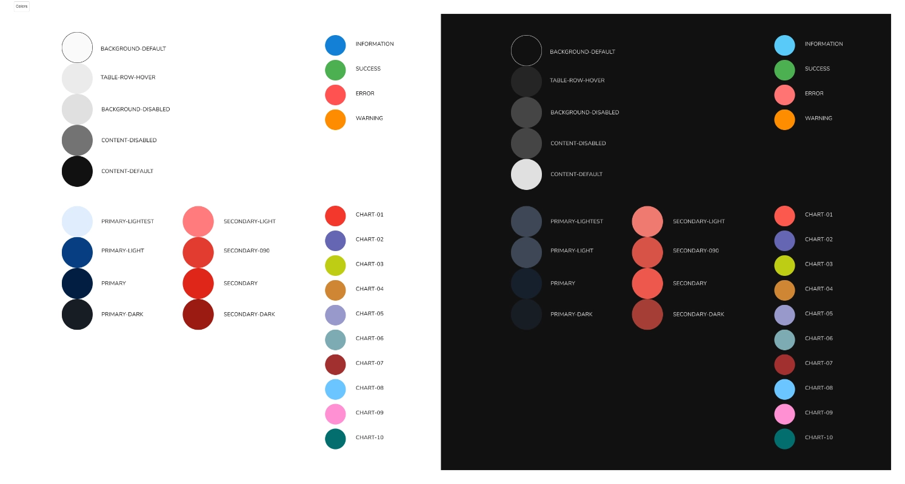
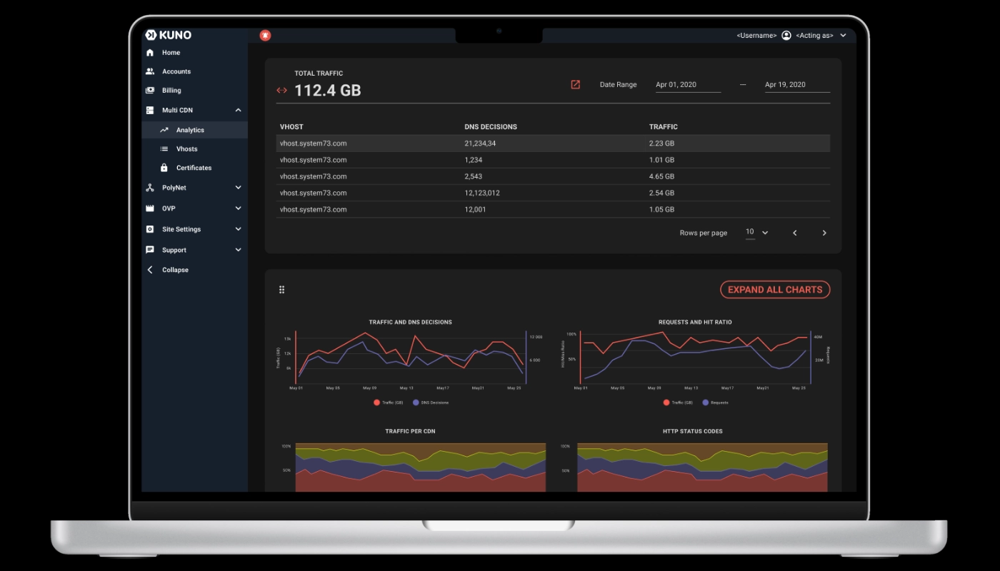
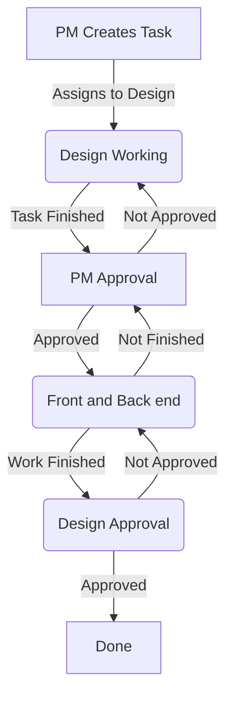
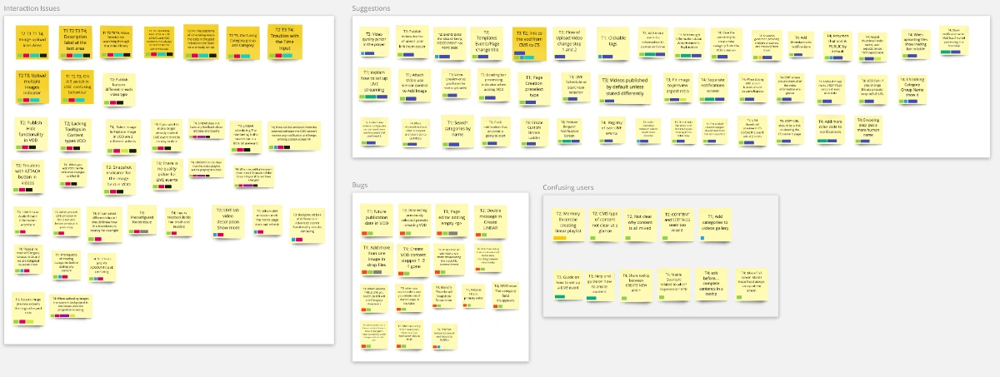
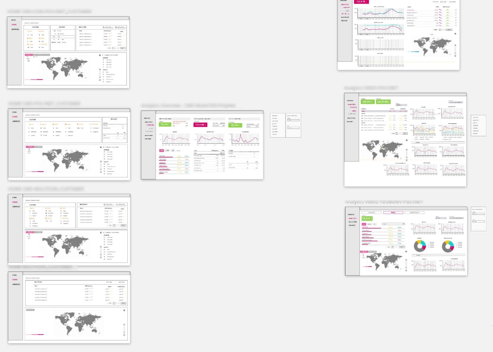

# KUNO

**Product Design · Online Video Platform · System73 · 2019–2022**

---

## The context

System73 was running two live TV channels, streaming products in real time. At some point the team decided to build their own video platform rather than rely on a third-party solution.

I was hired as the first designer. The company was pure engineering. No design culture, no design process, no shared vocabulary for talking about what design was even for.

That is where this started.

---

## The first year

They ignored me. Not maliciously. Engineers who have never worked with a designer simply do not know what to do with one. The frontend team built things their own way. My specifications sat in files nobody opened. We had arguments about pixels and components and what "done" actually means.

Eventually we started speaking the same language. Not because I won any argument, but because we built enough shared experience that the friction became useful instead of just frustrating.

That process of building shared language became the whole job.

---

## What we built

### The feature definition flow

A process for moving a feature from "someone said we should do this" to "this is shipped and working." PRD, wireframe, prototype, test, developer handover, validation, deploy. Not invented from scratch. Built through iteration, broken retrospectives, and a lot of things going wrong in predictable ways.

The goal was to get to a point where you could predict 80 to 90 percent of what a feature would look like before anyone wrote a line of code. We got there.

### The design system

Colors, components, interaction patterns for a platform built on Vuetify 2. The kind of system that makes a 160+ screen clickable prototype possible without losing your mind.

### The prototype

A living, clickable representation of the platform that developers could reference, stakeholders could react to, and PMs could use to scope work. Updated continuously for three years.

### The validation loop

A simple approval circuit that removed personal opinion from the process. PM creates task, design works, PM approves, dev builds, design approves, done. It sounds obvious. It was not, until it was documented and everyone agreed to it.

``` mermaid
graph TD;
  A[PM Creates Task] -->|Assigns to Design| B(Design Working);
  B -->|Task Finished| C[PM Approval];
  C -->|Approved| D(Front and Back end);
  D -->|Work Finished| E(Design Approval);
  E -->|Approved| F[Done];
  E -->|Not Approved| D;
  C -->|Not Approved| B;
  D -->|Not Finished| C;
```

### User testing

We tested, found things that did not work, documented them, fixed them. The surprises were always the same kind of surprise: users do not use things the way you expect. Every time.

### The Help Center

20+ features, documented for the people who actually had to use them. Still partially live at [docs.system73.com](https://docs.system73.com/) though the product has since transformed entirely into Edge Intelligence, Edge Delivery, and Edge Analytics.

### Wireframes

Every feature started here. Not pixel-perfect, not beautiful. Legible enough that a developer could tell you what they thought it was trying to do.

---

## What happened to it

The channels shut down. The company pivoted toward video distribution infrastructure. The Online Video Platform got repurposed as the foundation for a completely different product.

The team changed. The original product is gone. The company is still there, still working on those problems, and the foundations of what we built together are still underneath it.

Three years. 20+ features. One designer.

---

*Designed in Adobe XD and Figma · Vuetify 2 · 2019–2022*
