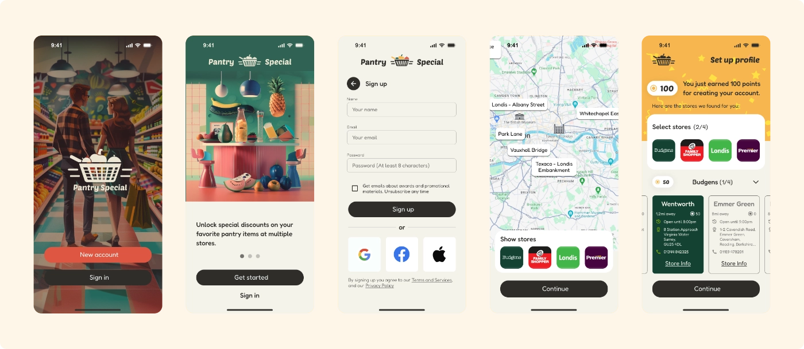
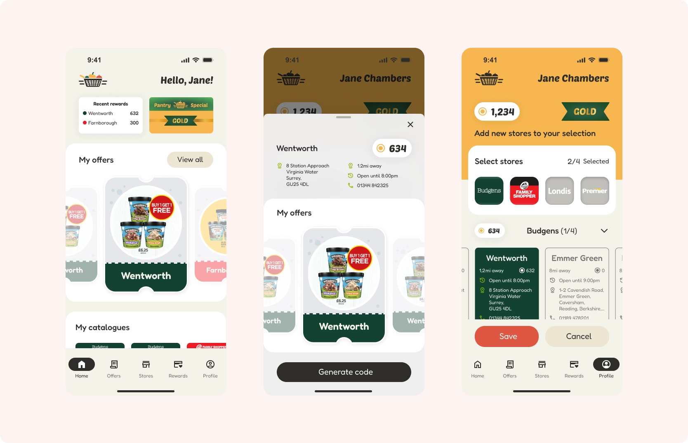

**Loyalty Mobile App Concept for a UK Grocery Network | Product Design**

## Brief

This high-fidelity mobile prototype was created as a design task for a supermarket loyalty platform. The challenge was to design an experience that could:

- Showcase 4 major UK convenience brands (Budgens, Londis, Premier, Family Shopper)
- Allow users to browse stores by brand and find stores near them
- View a store's full loyalty offer, including rewards, point balance, and promotions

The prototype was designed as part of a visual pitch to a major prospective client in the UK grocery retail sector.

## Design Strategy

The solution needed to:

- Be modular enough to represent different store brands
- Feel cohesive as a single app experience, not fragmented
- Emphasize geo-location, brand loyalty, and reward discovery

This is a multi-brand supermarket chain, not just a one-brand app. So clarity, adaptability, and simplicity were prioritized at every step.

## Key Screens 

### Home, Store, Profile

