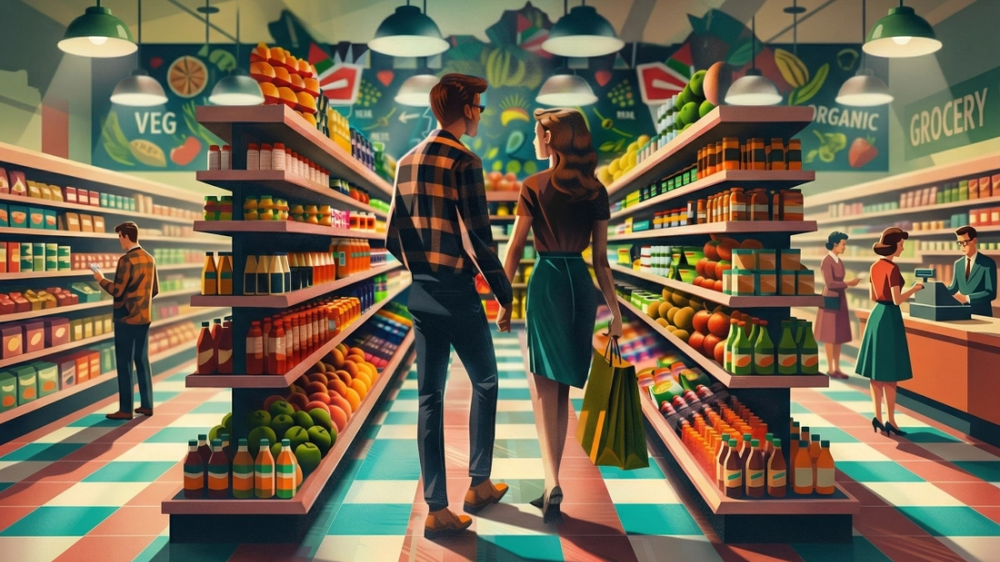
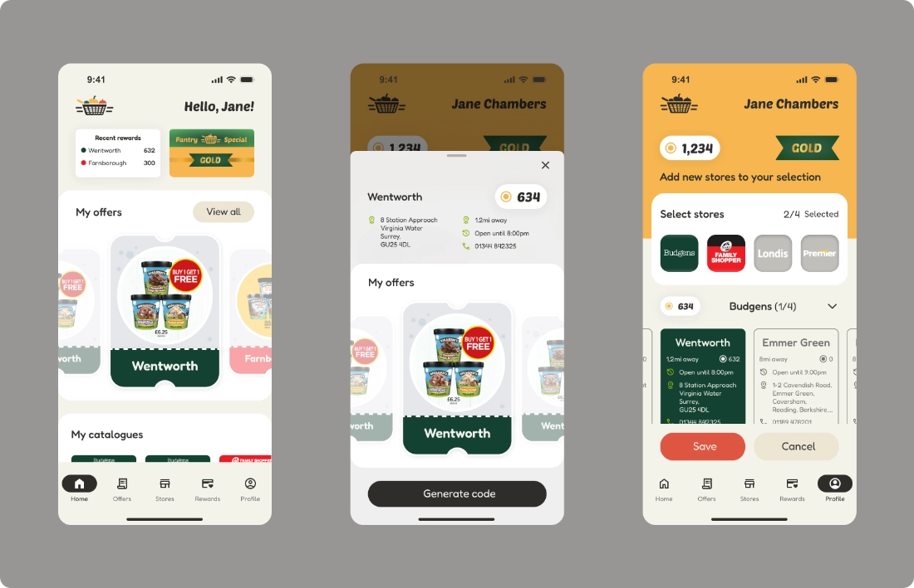
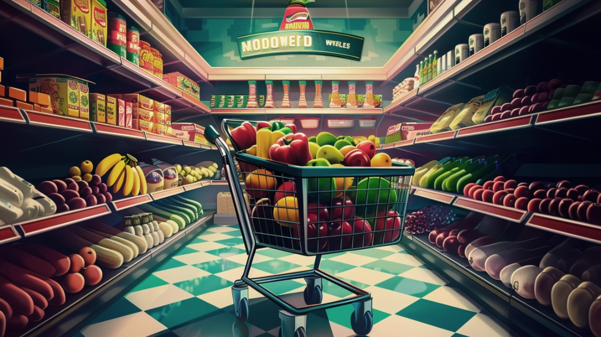
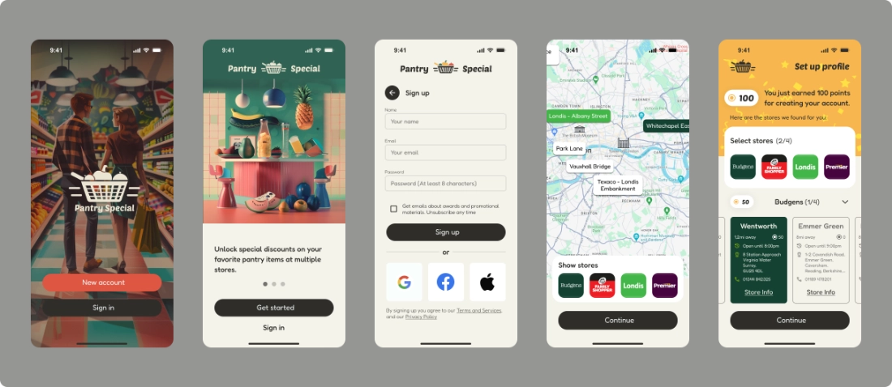

# Pantry Special

**Loyalty app concept · UK multi-brand grocery network · Product Design**

{ .postCover }

## The brief

A design task for a job application - but the kind that deserved real thinking.

The challenge: design a loyalty mobile app that could represent four distinct UK convenience brands (Budgens, Londis, Premier, and Family Shopper) under one roof. Users needed to find stores near them, track their loyalty points per brand, and discover active offers - all without the app feeling like four different products duct-taped together.

The prototype was intended as a visual pitch to a major UK grocery retail client.

## The hard part

Multi-brand apps have a specific failure mode: they either flatten every brand into a generic experience, or they fragment into four separate apps with shared navigation. Neither works.

The question I kept coming back to was: what does the user actually care about? Not the brand but the store. The specific Londis on their commute. The Premier where they do the weekly shop. Loyalty is local, not corporate.

That reframe changed the whole architecture. Instead of organising around brands, the app organises around the user's stores - which happen to belong to different brands. Brand identity surfaces at the store level, not the app level.

## The creative direction

Nobody asked for a specific visual concept. 
The brief was functional - screens, flows, components. But I had a question I couldn't let go of: what does grocery loyalty actually feel like?

I went back to the 1950s in the United States. That era when supermarket culture was just becoming a thing - the cheerful abundance, the perfect family, the promise that shopping was not a chore but a pleasure. The yellow and purple palette, the warmth of the imagery, the sense that going to the store was an event. That's the emotional register I was after.

All imagery was generated with Midjourney, styled to match the era - soft, warm, slightly idealized. 

Ultimately, It was a lot of fun. 
And it gave the app something most loyalty apps don't have: a feeling.

## What I built

A complete high-fidelity prototype covering the full user journey.

[:material-open-in-new: View prototype in Figma](https://www.figma.com/design/AHA7kfQHUIJGHSyxwQylvn/Pantry-Special?node-id=72-2425){ target="_blank" .md-button .md-button--tertiary }

### Loading & onboarding

Three-screen flow introducing the multi-brand concept without overwhelming new users. Clear value proposition upfront: unlock discounts at your stores.

### New user flow

Sign up, location permissions, profile setup, and store selection. Store selection is where brand differentiation first appears (naturally, in context, not as a menu of logos).

### Existing user experience

Personalised home screen showing the user's name, point balances per store, active offers, catalogues, and nearby store status at a glance. The home screen answers "what's available to me right now" without requiring navigation.

### Store detail

Opening hours, address, distance, contact, and a loyalty code generator. Everything needed to act on an offer in one screen.

### Design system

Component library covering brand colours, inputs, icons, and interaction patterns. Built to scale across all four brands without visual fragmentation.

## What I learned

Designing for a pitch (without a real user to test with, without a brief beyond the task description) forces a kind of discipline. Every decision has to be justifiable on its own terms.

The multi-brand problem turned out to be a hierarchy problem. Once I stopped thinking about brands as the organising principle and started thinking about the user's relationship with individual stores, the decisions got easier.

I didn't get the job. But I got to the end of the process, which, in a broken hiring market, means something.

The prototype never shipped. But the thinking holds.

---

*Designed in Figma · Imagery generated with Midjourney · High-fidelity prototype · iOS*