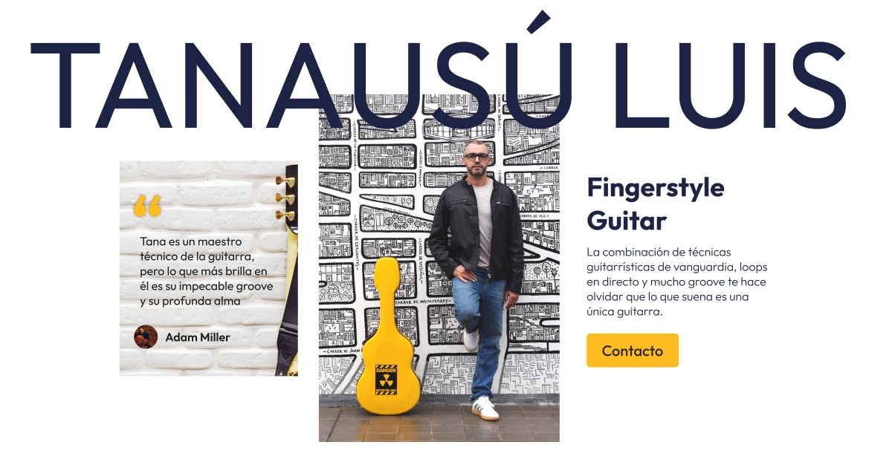
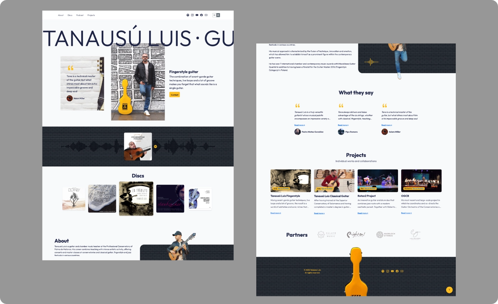

# Tanausú Luis

**Personal website · Fingerstyle guitarist · Palma de Mallorca**

{.postCover }

## The brief

Tana needed a website. He had some musical events coming up and needed a landing page, somewhere to send people.

That was the brief. One sentence.

What followed was a couple of weeks of open conversation, proposals accepted and rejected, and more design decisions than either of us could count.

**Live at:** [tanausuluis.com](https://tanausuluis.com)
**Built with:** HTML, CSS, JS
**Bilingual:** Spanish and English

## The concept

Tana bridges two worlds. Classical conservatory training and urban contemporary performance. The website needed to hold both without choosing between them.

The visual direction came from that tension. Urban feel, classical bones. Not a music website that looks like a music website. No staff lines, no eighth notes, nothing literal. Instead, soundwave graphics woven throughout the layout. The shape of sound without the cliche of it. Something that makes the site feel like a musician without announcing it.

The yellow came from his guitar case. That specific warm accent color tied everything together in a way no palette picker would have landed on. It was already there. It just needed to be used.

## The 48 hours

There was a solid 48-hour period where this looked absolutely terrible. Genuinely bad. Nothing worked, nothing felt right, the whole thing sat there looking like a mistake.

Then something clicked. One tweak led to another. Suddenly it all made sense.

That is the cool part of design. Nothing works, until it does.

## What I built

A single-page bilingual site covering everything that matters about Tana's work: hero with testimonial, discography linked to Spotify, podcast, projects, contact. Clean navigation, no clutter, nothing that competes with the music.

Every element works like a well-composed piece. Or at least that was the goal.

## In use

Tana uses it for concerts, masterclasses, and festival appearances. It lives at [tanausuluis.com](https://tanausuluis.com).

I am ridiculously proud of how this turned out. Not just because it is done, but because it reminded me why I fell in love with design in the first place.

---

*HTML/CSS/JS · Bilingual · Personal site · 2025*