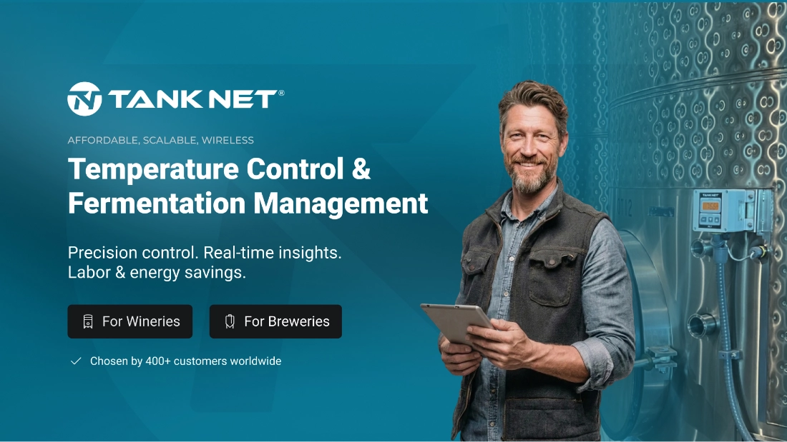
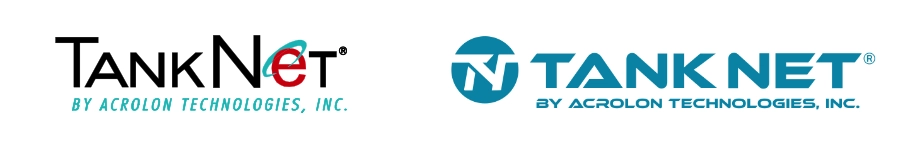
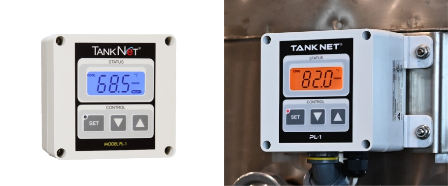
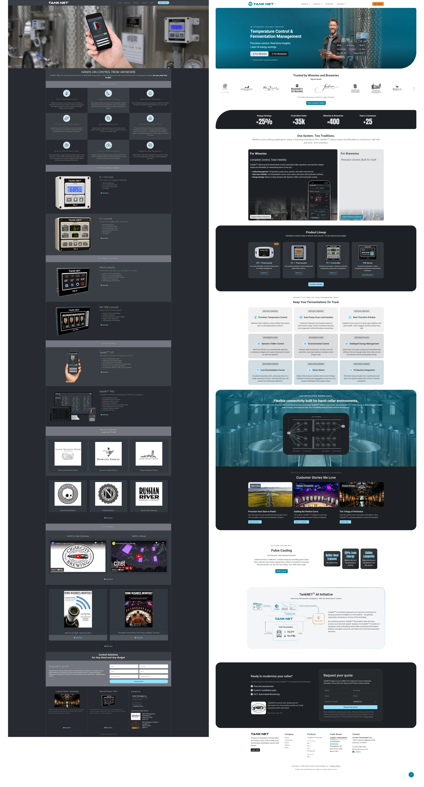
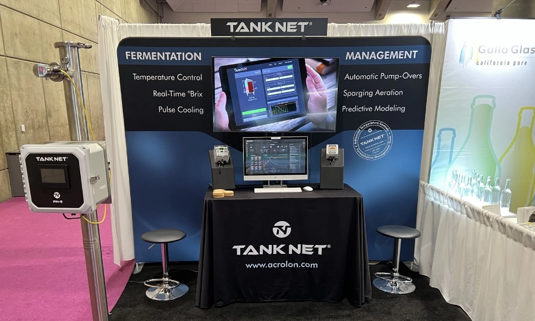
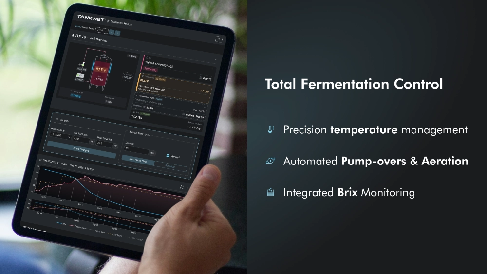

# TankNET

**Brand identity · Website · LinkedIn · Acrolon Technologies**

{.postCover }

---

## Context

Acrolon Technologies has been building fermentation management hardware and software for over **25 years**. Their controllers are installed in more than **400** wineries and breweries, from small craft operations to Opus One, Robert Mondavi, and Jackson Family Wines.

The reputation was built on product quality. The brand had kept pace, but a refresh was due. The logo's E graphic had started reading too close to Internet Explorer, and the colors were losing legibility against the black controller fronts in cellar conditions.

The website had the right information but not enough depth. Visitors who wanted to go further had nowhere to go.

I joined in January 2025 as Lead Design Consultant with full ownership of the brand refresh, website, and LinkedIn.

## Logo

The brief was practical: the mark needed to work at the size of a controller front panel label and at the size of a tradeshow backdrop. Printed on hardware and on vinyl. Rendered on screen.

We found a geometric, industrial typeface that reads as technical without being cold. Some optical corrections to the letter spacing sequence were made, a subtle adjustment that keeps the mark balanced at any size. The circular favicon mark was derived from the same font geometry, with enough modification that it reads as a distinct symbol rather than just initials.

Since the rebrand, every controller shipped carries the new mark. The brand now lives in cellars and brewhouses alongside the hardware.

## Controllers

The identity change is not just digital. It ships in a box.

## Website

The old site had the right information but could benefit from architecture improvement. More information was added for those visitors who need it.

The new site is built around progressive disclosure. It starts with the two clearest customer entry points, wineries and breweries, each with their own dedicated landing page, their own language and path to a quote.

### New Structure

From there the site moves through trust signals in deliberate order:

**Famous customers in the industry:** names that serious buyers recognise immediately.

**Numbers that build confidence:** 400+ clients, 35,000+ controlled tanks, 25% average energy savings, 25 years in business.

**One system, two traditions:** a clean split that directs each visitor to the information relevant to them.

**The full product lineup:** hardware and software presented together as a coherent system.

**Feature depth:** Pump-overs, Pulse cooling, Thread mesh protocol, the AI initiative and where it is going.

**Customer stories:** the people behind the numbers.

We kept everything that was working and built around it. The goal was a complete picture between hardware and software - the kind of site a prospective customer can spend real time in.

In the end the company's website just started looking like itself. 
Clear graphics, brand colors, and consistent fonts. 

## Tradeshow assets

TankNET exhibits at Unified Wine and Grape Symposium and CBC — two of the largest industry events in the US wine and beer markets.

The booth needed to carry the new brand into a physical space with confidence. Navy backdrop, clean typography, product photography and feature copy all consistent with the new brand language.

## Still in progress

The platform redesign, a complete overhaul of the 20-year-old TankNET software, is ongoing. That is a separate project and a separate story.

---

*Brand identity · HTML/CSS/JS · Tradeshow assets · LinkedIn · 2026*